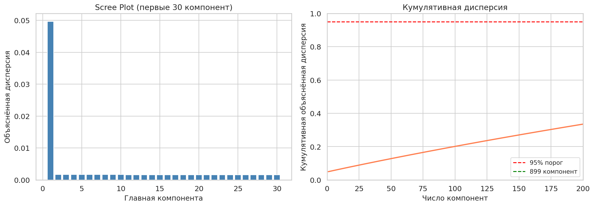
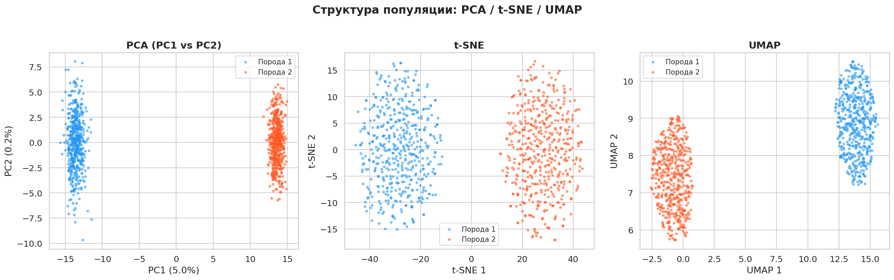

# Отчёт: Анализ структуры популяции на основе SNP-маркеров

**Проект:** genotype_dim_reduction
**Дата:** 12 апреля 2026
**Ноутбук:** `snp_explorer.ipynb`

---

## 1. Резюме

Исследование демонстрирует пайплайн снижения размерности для выявления популяционной структуры на основе SNP-генотипов. На синтетическом датасете (1000 особей, 10 000 SNP, две популяции) применены PCA, t-SNE и UMAP. Все три метода уверенно разделяют популяции на два кластера, подтверждая, что систематические различия в частотах аллелей между группами обнаруживаются уже первой главной компонентой.

---

## 2. Методология

### 2.1. PCA (Principal Component Analysis)

Линейный метод снижения размерности. Центрированная матрица генотипов раскладывается через SVD: $X = U\Sigma W^T$, где столбцы $W$ — главные компоненты, а $\sigma_i^2$ пропорциональны объяснённой дисперсии. Первые PC захватывают основной сигнал (популяционную структуру), последние — шум. В генетике PC1 обычно коррелирует с наибольшими различиями в частотах аллелей между группами.

**Параметры:** `random_state=42`, все 1000 компонент, далее отбор первых 20.

### 2.2. t-SNE (t-distributed Stochastic Neighbor Embedding)

Нелинейный метод для визуализации. Переводит попарные расстояния в вероятности через гауссово ядро (ширина подбирается под perplexity), в 2D-пространстве использует t-Стьюдента с 1 степенью свободы. Тяжёлые хвосты t-распределения решают «проблему скученности». Минимизирует KL-дивергенцию между распределениями.

**Параметры:** `n_components=2`, `perplexity=30`, `learning_rate="auto"`, `init="pca"`, `random_state=42`.

> **Важно:** `init="pca"` — это внутренняя инициализация координат *внутри* t-SNE. Алгоритм начинает оптимизацию с PCA-проекции 20 PC в 2D, а не со случайных точек. Это не то же самое, что preprocessing PCA: входные данные для t-SNE — уже 20 PC, а `init="pca"` определяет только стартовую точку градиентного спуска.

### 2.3. UMAP (Uniform Manifold Approximation and Projection)

Моделирует данные как points на римановом многообразии, строит k-NN граф и минимизирует бинарную кросс-энтропию между графами исходного и целевого пространств. Сохраняет глобальную структуру лучше t-SNE и работает быстрее ($O(n \log n)$).

**Параметры:** `n_components=2`, `n_neighbors=15`, `min_dist=0.1`, `metric="euclidean"`, `random_state=42`.

UMAP по умолчанию использует спектральную инициализацию (Laplacian eigenmaps) — в отличие от t-SNE с `init="pca"`, он не начинает оптимизацию с линейной проекции. При фиксированном `random_state` спектральная инициализация воспроизводима.

### 2.4. Почему PCA перед t-SNE/UMAP?

10 000 SNP содержат значительный шум. Проецирование на первые 20 PC отфильтровывает шумовые измерения, ускоряет нелинейные методы и улучшает качество эмбеддинга — стандартная практика в популяционной генетике и цитометрии.

Data flow:

```
    10 000 SNP (int8)
         │
         ▼
    PCA → 20 PC (8.10% дисперсии)
         │
    ┌────┴────┐
    ▼         ▼
  t-SNE      UMAP
    │         │
    ▼         ▼
   2D         2D
```

---

## 3. Входные данные

### 3.1. Датасет

| Параметр | Значение |
|----------|----------|
| Особи ($n$) | 1000 (2 популяции по 500) |
| SNP-маркеры ($p$) | 10 000 |
| Формат матрицы | $(1000 \times 10000)$, `int8` |
| Размер памяти | 9 765.6 KB (~9.5 MB) |
| Seed | 42 |

### 3.2. Генерация

- Базовые частоты аллелей: равномерное распределение $U[0.05, 0.5]$
- Дивергентные SNP: 3 000 маркеров со смещением частот между популяциями (`freq_shift=0.3`)
- Генотипы сэмплируются по модели Харди-Вайнберга: $P(AA)=p^2$, $P(Aa)=2p(1-p)$, $P(aa)=(1-p)^2$

### 3.3. Распределение генотипов

| Значение | Генотип | Доля |
|----------|---------|------|
| 0 | aa (гомозигота референс) | 54.2% |
| 1 | Aa (гетерозигота) | 35.4% |
| 2 | AA (гомозигота альтернатива) | 10.3% |

Дисбаланс в сторону 0 объясняется тем, что базовые частоты альтернативного аллеля лежат в диапазоне [0.05, 0.5] — референсный аллель в среднем чаще.

---

## 4. Результаты

### 4.1. PCA

| Метрика | Значение |
|---------|----------|
| Компонент для 95% дисперсии | **899** |
| Дисперсия первых 20 PC | **8.10%** |
| Форма PC-матрицы | $(1000, 20)$ |

Высокое число компонент (899 из 1000) для 95% дисперсии ожидаемо: каждый из 10 000 SNP вносит небольшую долю вариации, и сигнал популяционной структуры сосредоточен в первых компонентах, тогда как остаток — индивидуальный шум.

**Scree plot** показывает резкое падение объяснённой дисперсии после первых компонент:



Кумулятивная кривая пересекает порог 95% на компоненте 899.

### 4.2. t-SNE и UMAP

Оба метода, применённые к первым 20 PC, дают **чёткое разделение на два кластера**, соответствующих «Породе 1» и «Породе 2».

| Метод | Время выполнения | Результат |
|-------|-----------------|-----------|
| t-SNE | ~10 сек | Два компактных кластера, хорошая сепарация |
| UMAP | ~5 сек | Два кластера, более выраженные границы |

### 4.3. Сравнительный дашборд

Три графика (PCA PC1 vs PC2 / t-SNE / UMAP), раскрашенные по породам:



- **PCA:** PC1 отделяет популяции, PC2 показывает внутрипопуляционную вариацию
- **t-SNE:** локальная структура сохранена, кластеры плотные
- **UMAP:** глобальная геометрия лучше, кластеры отчётливее

Все три метода подтверждают: две популяции образуют **статистически различимые кластеры** на основе различий в частотах аллелей 3 000 дивергентных SNP.

---

## 5. Выводы

1. **PCA эффективен для первичного обнаружения структуры.** Уже PC1 разделяет популяции, что согласуется с классическими результатами Patterson et al. (2006).
2. **t-SNE и UMAP подтверждают кластеризацию.** Оба метода, получив на вход 20 PC, воспроизводят двухкластерную структуру без информации о метках.
3. **PCA как preprocessing — необходимость.** 20 PC объясняют лишь 8.10% дисперсии, но именно в них сосредоточен сигнал популяционной структуры. Остальные 92.9% — индивидуальный шум, который мешает нелинейным методам.
4. **Пайплайн готов для реальных данных.** Заменой генератора синтетических данных на загрузку матрицы дозиров (VCF → PLINK → numpy) анализ переносится на реальные генотипы.

---

## 6. Стек технологий

| Компонент | Версия |
|-----------|--------|
| Python | 3.13 |
| numpy | 2.4 |
| scikit-learn | 1.8 |
| umap-learn | 0.5 |
| matplotlib | 3.10 |
| seaborn | 0.13 |
| jupyter | 1.1 |

---

## 7. Ссылки на артефакты

- **Ноутбук с кодом и визуализациями:** `snp_explorer.ipynb`
- **Зависимости:** `pyproject.toml`
- **Scree plot:** `plots/scree_plot.png`
- **Дашборд PCA/t-SNE/UMAP:** `plots/dashboard.png`
